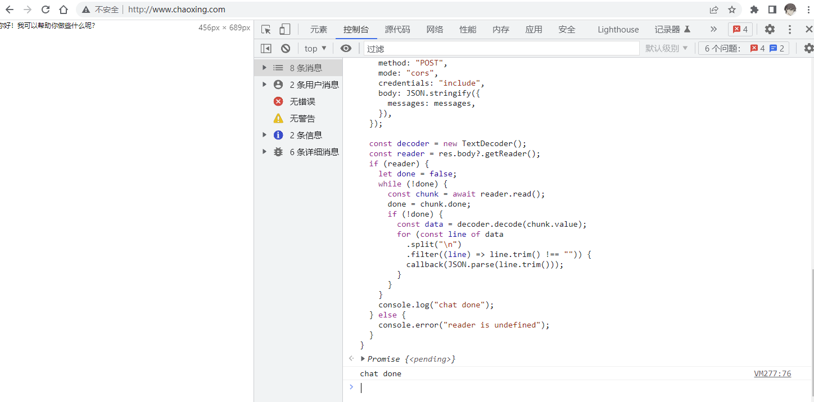
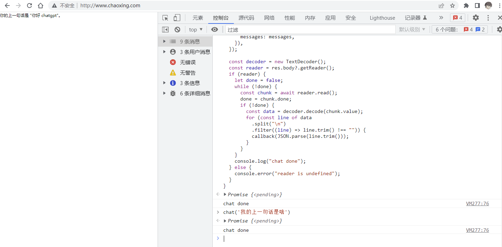
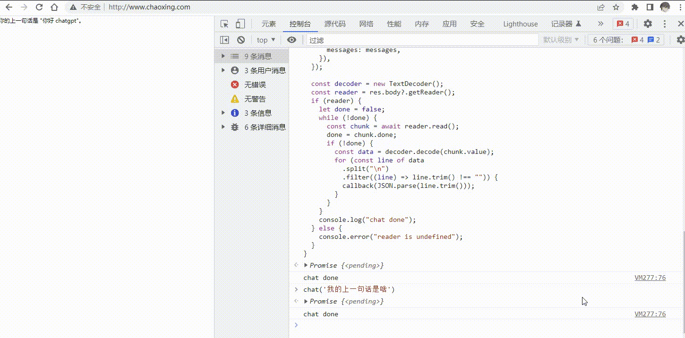

# chatgpt nodejs api 服务

> 本项目只是作为中转服务器，防止区域问题被 chatgpt 封禁账号
> 仅限个人使用，或者另起一个服务器进行调用

- 使用 nodejs express 作为服务器

- 使用官方 chatgpt api 接口

- 处理了官方接口的返回值

## 环境

- 一台国外服务器

- nodejs 环境

## 环境变量

在项目中根目录新建一个 `.env` 文件，里面输入下面的内容

```
# Chatgpt 调用KEY，需要去官网申请 https://platform.openai.com/
OPENAI_API_KEY="xxxxxxxxxxxxxxxxxxxxxxxxxxxx"
# 服务器访问KEY，自定义，前端调用时在请求头中带上即可，看下面示例，主要是防止IP泄露后被别人调用
AUTHORIZATION_KEY="xxxxxxxxxxxxxxxxxxxxxxxxxxx"
```

## 部署

```sh
# 克隆项目
git clone https://github.com/enncy/openai-api-server
# 进入项目
cd openai-api-server
# 全局安装 typescript
npm i typescript -g
# 安装项目依赖
npm install
# 打包项目
tsc
# 运行项目
npm run start
```

## 接口

---

## `POST` /chat

参数:

- `model` : chatgpt 模型
- `messages` : 对话上下文，每次新的对话可以追加到数组最后，需要对 chatgpt 的返回数据进行存储，第二次调用时一并传递，实现记忆型对话功能。

返回类型: stream

返回示例：

正常信息的返回

```
{done:false,error:false,content:"hi "}
{done:false,error:false,content:"i"}
{done:false,error:false,content:"am"}
{done:false,error:false,content:"chatgpt"}
{done:false,error:false,content:"\n。"}
{done:true,error:false,content:"[DONE]"}
```

存在错误信息的返回，（这里的错误指的是 chatgpt 调用过程中的报错，以及服务器报错）

```
{done:false,error:true,content:""}
{done:true,error:false,content:"[DONE]"}
```

## 示例

> 接口返回的是 stream 类型数据，需要使用 fetch 进行解析

---

1. 因为服务器默认是 http，这里就不演示 https 了（http 在 https 网站中无法发起请求）， 进入一个 http 网站， http://chaoxing.com/

2. 执行以下代码

```ts
/** 对话上下文 */
let messages: { role: "user" | "assistant"; content: string }[] = [];

chat("你好 chatgpt");

// 聊天方法
async function chat(content: string) {
  const user_message: { role: "user" | "assistant"; content: string } = {
    role: "user",
    content: content,
  };
  const assistant_message: { role: "user" | "assistant"; content: string } = {
    role: "assistant",
    content: "",
  };

  // 存储用户消息
  messages.push(user_message);

  // 开始调用聊天接口，并读取数据
  await streamChat(messages, ({ done, error, content }) => {
    if (done) {
      //
    } else if (error) {
      console.error(content);
      // 显示错误
      assistant_message.content = content;
    } else {
      // 追加消息
      assistant_message.content = assistant_message.content + content;
    }

    // 显示
    document.querySelector("body").innerText = assistant_message.content;
  });

  // 存储chatgpt回复消息
  messages.push(assistant_message);
}

/** 流式聊天 */
async function streamChat(
  /** 上下文 */
  messages: { role: "user" | "assistant"; content: string }[],
  /** 回调 */
  callback: (data: { done: boolean; error: boolean; content: string }) => void
) {
  const res = await fetch("http://xxx.xxx.xxx.xxx/chat", {
    headers: {
      "Content-Type": "application/json",
    },
    method: "POST",
    mode: "cors",
    credentials: "include",
    body: JSON.stringify({
      messages: messages,
    }),
  });

  const decoder = new TextDecoder();
  const reader = res.body?.getReader();
  if (reader) {
    let done = false;
    while (!done) {
      const chunk = await reader.read();
      done = chunk.done;
      if (!done) {
        const data = decoder.decode(chunk.value);
        for (const line of data
          .split("\n")
          .filter((line) => line.trim() !== "")) {
          callback(JSON.parse(line.trim()));
        }
      }
    }
    console.log("chat done");
  } else {
    console.error("reader is undefined");
  }
}
```

输出结果：




 

 